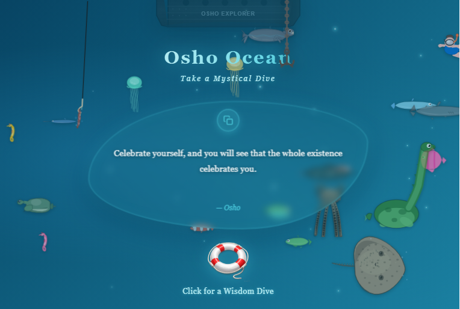

# 🌊 Osho Ocean 🌊 

### "A vida começa onde o medo termina." 
  
[✨ Clique aqui para mergulhar no Osho Ocean ✨](https://nanncy-keller.github.io/osho-ocean/)

---

## 🎀 Sobre o Projeto 

Olá! Seja bem-vinda(o) ao **Osho Ocean**, uma experiência web mágica e imersiva criada para trazer paz e sabedoria ao seu dia! 🐠✨ Este projeto nasceu do desejo de unir o poder da **tecnologia** com a serenidade da **meditação**. 

O objetivo principal foi construir um ambiente tranquilo onde você possa mergulhar nos pensamentos de Osho. O layout foi lapidado com a ajuda de IA para garantir aquela "vibe relaxante", com animações suaves e uma atmosfera de fundo do mar que é um verdadeiro abraço na alma! 🌊💙

---

## 🧠 Foco Técnico: O Poder da Aleatoriedade

* **Math.random():** Para selecionar citações de forma dinâmica dentro do nosso `quotesArray`.
* **Math.floor():** Para garantir que as posições dos índices sejam sempre números inteiros perfeitos!

---

## 📂 Estrutura do Projeto (Project Structure)

Aqui está como a magia está organizada dentro das pastinhas:

* 📄 `index.html`: O coração do nosso oceano.
* 📁 `css/`:
    * `main.css`: Estilos gerais.
    * `ocean-env.css`: O clima subaquático.
    * `ship-effects.css`: Efeitos especiais.
    * `ui-animations.css`: As animações da interface.
* 📁 `js/`:
    * `main.js`: Lógica principal e o uso do `Math.random()`.
    * `particles.js`: O brilho das partículas de luz.
    * `sea-life.js`: A vida que se move no fundo do mar.
* 📁 `assets/`:
    * `images/shell.png`: O botão para a frase aleatória.
    * `sounds/splash.mp3`: O som relaxante do mergulho.

---

## 🚀 Tecnologias Utilizadas

1.  **HTML5 & CSS3:** Para a estrutura e animações subaquáticas.
2.  **JavaScript (ES6+):** Manipulação de DOM, lógica matemática e interatividade.
3.  **AI Collaboration:** Usei inteligência artificial para refinar o design do CSS e os efeitos visuais.

---

### Desenvolvido com muito 💙 por **Nancy Keller**

Este é um projeto prático para a graduação de **Análise e Desenvolvimento de Sistemas** na **Uniasselvi**.

✨ *Mergulhe fundo no seu autoconhecimento!* ✨

